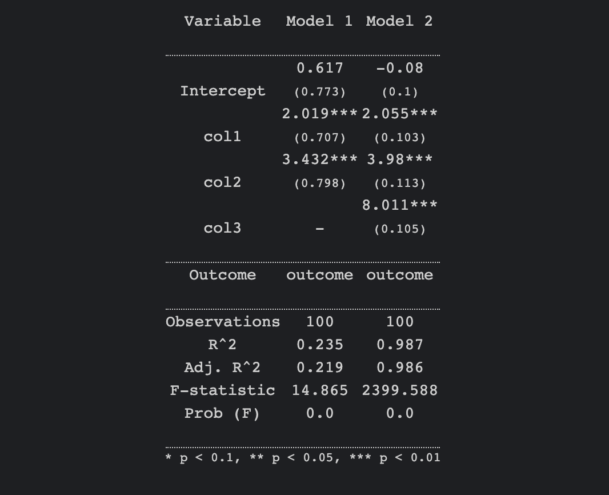
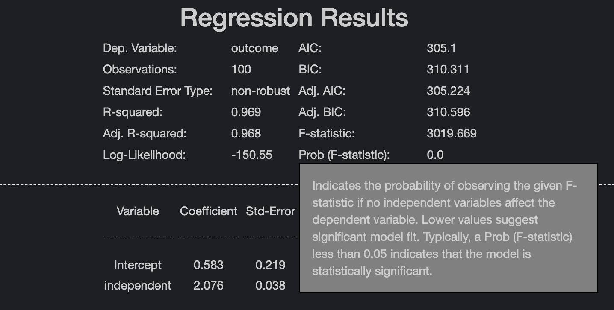

# CausalKit

## A Package for Causal Inference inspired by econometrics and modern ML API design

CausalKit is a Python package designed for students and researchers alike. It offers a simple approach to economic and statistical analysis, emphasizing ease of use, interpretability and causation. 


### Features

1. Simple API with r like syntax for linear regression
2. Model display functions for easy comparison of models or interpretation of results
3. Intuitive interfaces for common causal inference methods such as IV, panel methods and logit models. 
4. Simple library architecture allowing custom models to be added easily which will leverage existing functionality such as model display functions and r like syntax.

### Installation

```bash
pip install causalkit
```

### Get Started

```python
import pandas as pd
from src.models.linreg import LinReg

data = pd.read_csv("data.csv")
model = LinReg(df=data,
               outcome="outcome_col", 
               independent=["independant_col1",
                            "independant_col2"],
               standard_error_type='hc0')
model.summary(content_type='static')
```

#### Regression
1. rgonomic API commands for linear regression, with support for fixed effects, IV, and more.

  - To use all columns in a dataset simply call:
```python
import pandas as pd
from src.models.linreg import LinReg

data = pd.read_csv("data.csv")
model = LinReg(df=data,
               outcome="outcome",
               independent=["."])
```
- Please see the 2__regression_commands_walkthrough.ipynb in /notebooks for more details & functionality.

2. Stargazer based regression outputs for easy comparison of models.

```python
import pandas as pd
from src.models.linreg import LinReg
from src.displays.display_linear import display_models

data = pd.read_csv("data.csv")
model = LinReg(df=data,
               outcome="outcome_col", 
               independent=["independant_col1",
                            "independant_col2"],
               standard_error_type='hc0')

model_2 = LinReg(df=data,
               outcome="outcome_col",
               independent=["independant_col1",
                            "independant_col2",
                            "independant_col3"],
               standard_error_type='hc0')

display_models([model, model_2])
```


3. Interactive regression outputs to remind you what a stats term means. Just call the .summary() method on your model object and hover over the terms to see their definitions.




### Upcoming Features:

1. Dropping of na values automatically upon model instantiation
2. IV Regression with angrist data as example
3. T test for difference in means
4. Random effect and mixed effects models
5. Common model diagnostics + assumption checks (linearity, normality of residuals, homoscedasticity, and absence of multicollinearity. This could include plots (like QQ plots, residual vs. fitted value plots) and statistical tests.)
6. Regularization (Lasso, Ridge, Elastic Net)
7. GLM's (poisson, negative binomial, multinomial)
8. Bootstrap + resampling methods (bootstrap se ci, permutation tests)
9. build more Causal inferenece methods interfaces (matching, regression discontinuity, synthetic control, etc.)
10. Interactive interaction explorer (interactive visualization with sliders for continuous variables and dropdowns for categorical variables)
11. Refactor Fixed Effects class to handle high dimensional fixed effects efficiently, add method to support within estimator, integrate tabmat library for efficient matrix operations.
